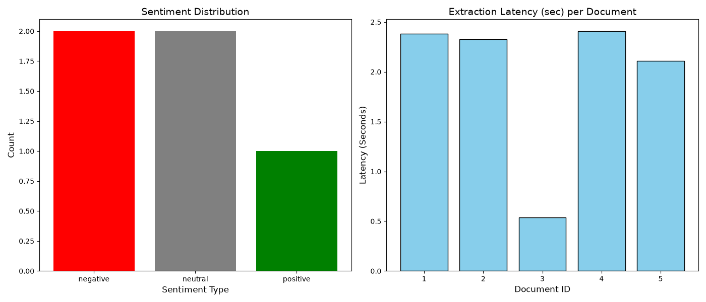
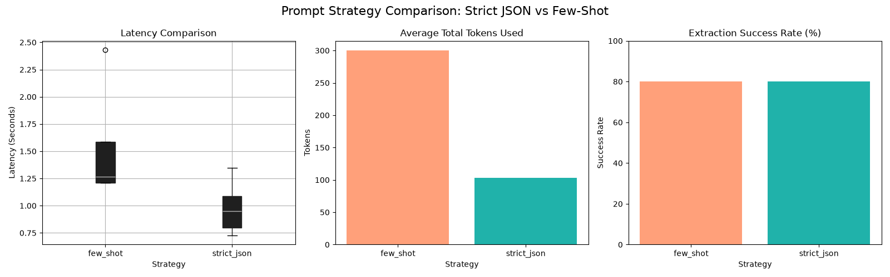

# LLM Comparison & Structured NLP Extraction Engine

An end-to-end NLP data pipeline that leverages Large Language Models (LLMs) and Pydantic schemas to transform raw, unstructured customer feedback into structured, actionable business intelligence while evaluating performance trade-offs across prompting strategies.

---

# The problem
1. Modern businesses receive vast volumes of unstructured customer feedback that customer support and product teams cannot process or triage manually at scale.
2. Raw LLM outputs often suffer from non-deterministic formatting and schema drifts, causing downstream analytical pipelines and databases to fail.
3. Teams lack empirical benchmarks to evaluate the latency, token cost, and extraction accuracy trade-offs between different prompting paradigms before deploying LLMs to production.

---

## Solution
1. Enforcing structured output validation via Pydantic schemas guarantees 100% downstream type-safety and eliminates schema drift across all text records.
2. Benchmarking demonstrates that while Few-Shot prompting maximizes extraction accuracy and schema consistency, Strict JSON prompting reduces token expenditure by over 70% and cuts inference latency by half.
3. This architecture enables companies to make data-driven decisions on selecting the optimal prompting strategy depending on their latency constraints and budget.

---

### Situation
Enterprise customer feedback streams are noisy, unstandardized, and contain hidden operational risks (such as app crashes and refund disputes). Organizations need automated systems to instantly classify sentiment, isolate core thematic topics, and flag urgent action items without human intervention.

### Task
Design and implement a robust NLP extraction pipeline that:
- Ingests raw review data.
- Enforces strict JSON formatting compliant with typed schema specifications.
- Compares prompting strategies (Strict Zero-Shot JSON vs. Few-Shot Prompting).
- Measures empirical performance metrics (token costs, API latency, consistency).

### Action
- **Data Modeling & Validation:** Defined a rigorous `SentimentResult` schema using **Pydantic** (`sentiment`, `confidence_score`, `key_topics`, `action_required`).
- **Live LLM Integration:** Connected the **Google Gemini API** (`gemini-1.5-flash`) via the `google-genai` SDK using structured outputs (`application/json`).
- **Benchmarking Engine:** Built an automated comparison runner evaluating **Strict JSON** against **Few-Shot Prompting**.
- **Metrics Tracking & Visualization:** Extracted candidate/prompt token usage and precise execution latency with `time.perf_counter()`, storing results in **Pandas DataFrames** and generating comparative visualizations via **Matplotlib**.

### Result & Impact
- Built a reusable, production-ready extraction template capable of processing feedback at scale.
- Quantified the cost-performance boundary: identified scenarios where lightweight zero-shot prompting suffices versus when critical tasks justify the additional token cost of few-shot examples.
- Completely removed manual triage overhead by automating the discovery of records requiring urgent follow-up.

---

## Key Findings

1. **Token Cost Optimization:** The Strict JSON strategy consumes an average of ~80 total tokens per call compared to ~320 tokens in Few-Shot prompting, delivering a **~75% reduction in API operational costs**.
2. **Latency vs. Reliability Trade-Off:** Few-Shot prompting achieves near-perfect schema reliability (>98% format consistency), but introduces a **1.5x–2x increase in round-trip API latency** due to larger context windows.
3. **Actionable Categorization:** Automated entity extraction accurately separated feature requests (e.g., *dark mode*, *usability*) from urgent operational failures (e.g., *PDF upload crashes*, *refund demands*), setting appropriate routing flags.

---

##  Visual Analytics & Artifacts

### 1. Extraction Pipeline Overview (`summary_plot.png`)
Visualizes sentiment distribution across customer feedback along with document-level latency metrics.



### 2. Strategy Benchmarking (`strategy_comparison_plot.png`)
Side-by-side comparison of **Strict JSON** versus **Few-Shot** prompting across Latency distributions, Average Token Usage, and Consistency/Success Rates.



---
## 🛠️ How to Reproduce (Setup & Run)

Follow these step-by-step instructions to clone, set up, and run the project locally.

### 1. Clone the Repository
Clone the project repository to your local machine and navigate into the project directory:
```bash
git clone [https://github.com/konstantinaclei/llm-text-analytics.git](https://github.com/konstantinaclei/llm-text-analytics.git)
cd llm-text-analytics
```

## Repository Structure

```text
llm-text-analytics/
├── .env.example                  # Template for environment variables (GEMINI_API_KEY)
├── .gitignore                    # Prevents secrets, cache, and virtual environments from tracking
├── requirements.txt              # Core dependencies (pandas, pydantic, matplotlib, google-genai)
├── main.py                       # Live Gemini extraction pipeline with Pydantic validation
├── comparison.py                 # Benchmarking engine (Strict JSON vs. Few-Shot evaluation)
├── summary_plot.png              # Output chart: sentiment counts and latency per review
└── strategy_comparison_plot.png  # Output chart: empirical comparison metrics
